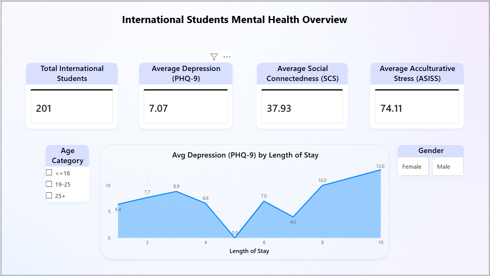
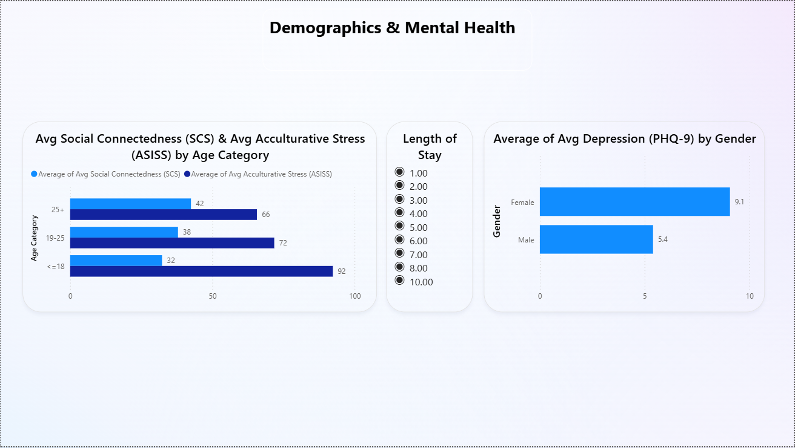

# Mental-Health-Dashboard
PostgreSQL + Power BI project analyzing mental health metrics of Japanese university students with interactive dashboards.

Project: Mental Health of University Students in Japan

1. Context and Motivation
This project is based on a dataset derived from psychological tests applied to university students in Japan, both international and domestic.
The metrics included are widely used in mental health research:
- PHQ-9 → Depression
- SCS → Social Connectedness
- ASISS → Acculturative Stress
The key research question guiding this analysis is:
“How does depression vary among international students depending on their length of stay in Japan?”

2. Database Modeling
The dataset was structured into a relational database using PostgreSQL:
- Creation of the students table.
- Import of the dataset via pgAdmin.
- SQL queries to explore metrics by age, gender, and length of stay.
- Use of CASE statements in SQL to generate simple labels and segmentations.
- Example: dropping unnecessary columns to keep the dataset clean.

3. Data Preparation in Power BI
Within Power BI, light adjustments were made in Power Query:
- Renaming columns for clarity and professional presentation.
- Organizing fields to facilitate visualization building.

4. Visualization in Power BI
Two main pages were designed:
Page 1 – Overview
- General KPIs: number of students, averages of PHQ-9, SCS, and ASISS.
- Line chart: Depression vs Length of Stay.
- Slicers for age and gender to enable interactive exploration.

Page 2 – Demographics
- Clustered bar chart: Age vs Stress & Social Connectedness.
- Stacked bar chart: Gender vs Depression.
- Slicers: length of stay, age, and gender.
  This design applies visual storytelling to highlight clear patterns and demographic comparisons.

5. Data-Driven Conclusions
- Length of stay influences depression, but not linearly. Fluctuations suggest intermediate factors at play.
- Students ≤18 years show the highest acculturative stress (ASISS).
- Female students consistently report higher depression scores than male students.
- Age does not guarantee stronger social connectedness.
- Combining age, gender, and length of stay reveals risk profiles, useful for psychological or social interventions.

6. Skills Demonstrated
- SQL/PostgreSQL: relational modeling, analytical queries, use of CASE, and column management.
- Power Query: light adjustments (renaming columns, organizing fields).
- Power BI: professional visualization, dashboard design, and user experience.
- Documentation: clear narrative and structured project presentation.
